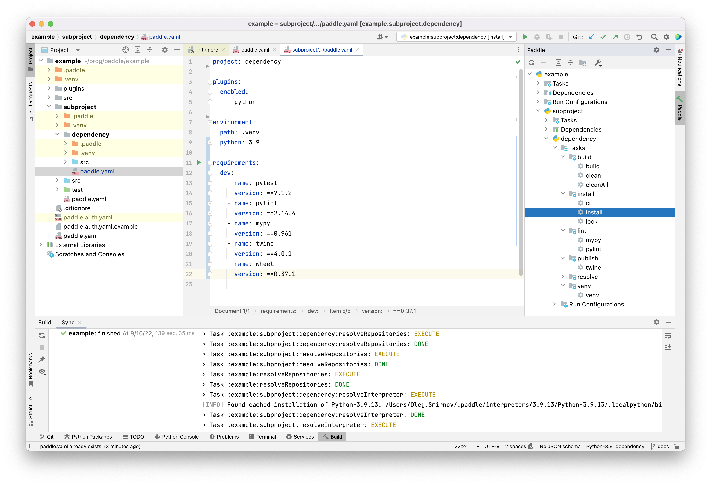
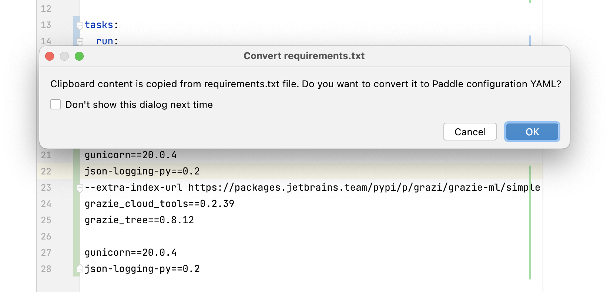

<h1>  
<div>Paddle</div> 
</h1>

[](https://research.jetbrains.org/)
[](https://github.com/JetBrains-Research/paddle/releases/latest)


[](https://plugins.jetbrains.com/plugin/17452-paddle)

Paddle is a fresh, extensible, and IDE-friendly build system for Python. It provides a declarative way for managing
project dependencies, configuring execution
environment, running tasks, and much more.

### Guide outline

- [Why should I use Paddle?](#why-should-i-use-paddle)
- [Getting started](#getting-started)
  - [Prerequisites](#prerequisites)
  - [Installation](#plugin-installation)
  - [Quick start](#quick-start)
- [Key concepts](#key-concepts)
  - [Project](#project-concept)
  - [Tasks](#tasks-concept)
  - [Plugins](#plugins-concept)
- [YAML Configuration](#yaml-configuration)
  - [Core sections](#core-sections)
    - [Project](#project)
    - [Subprojects](#subprojects)
    - [Roots](#roots)
    - [Plugins](#plugins)
  - [Python sections](#python-sections)
    - [Metadata](#metadata)
    - [Environment](#environment)
    - [Repositories](#repositories)
      - [Authentication](#authentication)
    - [Requirements](#requirements)
    - [Tasks section](#tasks-section)
      - [Run](#tasks-section)
      - [Test](#tasks-section)
      - [Publish](#tasks-section)
  - [Docker & SSH sections](#docker-ssh-sections)
- [Tasks](#tasks)
  - [Core tasks](#core-tasks)
  - [Python tasks](#python-tasks)
- [Example: multi-project build](#example-multi-project-build)
- [Troubleshooting](#troubleshooting)
- [Contact us](#contact-us)

### Why should I use Paddle?

- **Paddle is very easy to start with**.
  You only need a single YAML configuration file for your project,
  and the build system will do all the rest.
  If you are familiar with the basic concepts of a build
  system like [Gradle](https://docs.gradle.org/current/userguide/what_is_gradle.html),
  and also have some experience of using various Python development tools
  (such as `venv`/`pytest`/`pylint`/`twine`) — you already know how to use Paddle!
- **Paddle supports Python**.
  It is not just another CLI tool to solve some limited scope of tasks which appear when you are
  developing in Python — Paddle is an ultimate solution for a Python project.
  It resolves and installs a necessary version of the Python interpreter automatically,
  manages dependencies in the virtual environments, provides a way to reliably run incremental
  tasks with scripts/tests/linters, and more.
- **Paddle supports multi-project builds.**
  [Monorepos](https://en.wikipedia.org/wiki/Monorepo) are gaining popularity
  in the industrial software development, and if you are using them, you are in luck. With Paddle, it became possible
  to declare intra-project dependencies between packages and to configure complicated
  building and publishing pipelines for your Python monorepo.
- **Paddle uses caching**.
  Unlike standard Python virtual environment utilities (e.g.,`venv`), Paddle downloads and installs Python packages to
  the internal cache repository, and then creates symbolic links from these files to your local project environments.
  This allows Paddle to save a significant amount of hard drive space, especially in the case of a multi-project build
  with several environments targeting the same Python package with different versions.
- **Paddle is fully supported in the PyCharm IDE.**
  You can use an old-fashioned command line interface or choose a preferred brand-new
  plugin for [PyCharm](https://www.jetbrains.com/pycharm/),
  a popular IDE for Python developed by [JetBrains](https://www.jetbrains.com/).
- **Paddle is an extensible general-purpose build system by its nature.**
  Although it focuses on the Python projects at first, it could also be easily customized to
  suit your own needs by writing and using various plugins.

[//]: # (  For instance, the bundled `docker` and `ssh` plugins provide a way to run your tasks within)

[//]: # (  other execution environments, such as)

[//]: # (  [Docker containers]&#40;https://www.docker.com/resources/what-container/&#41; and remote machines.)

## Getting started

### Prerequisites

To run Paddle, you need:

- **Linux** (tested on Ubuntu 20.04) or **macOS** (tested on Big Sur and Monterey).
- **PyCharm 2022.1 or higher** (if you want to use the Paddle plugin for PyCharm).
- **Internet access** (so that Paddle can access and index PyPI repositories, download packages,
  etc.)

To be able to load and install various versions of Python interpreters, please, follow the
instructions given [here](https://github.com/pyenv/pyenv/wiki#suggested-build-environment) for your
platform.

**Experimental:** Paddle CLI is compiled as
a [native image](https://www.graalvm.org/22.1/reference-manual/native-image/) using GraalVM and available for Linux and
macOS. You can
still use plain `paddle-$version-all.jar` build with Java 8 (or higher).

### Plugin Installation

The preferable way to install Paddle is to download a PyCharm plugin from
the [JetBrains Marketplace](https://plugins.jetbrains.com/plugin/17452-paddle).



The plugin already contains a bootstrapped Paddle build system inside (so you don't even have to install
anything else manually) and supports a bunch of features:

- automatic [SDK configuration](https://www.jetbrains.com/help/idea/configuring-python-sdk.html) for
  Paddle projects;
- smart auto-completion and pre-configured YAML templates for Paddle build files;
- features (like copy-paste handlers) to migrate from `requirements.txt` to Paddle YAML
  configurations;
- a number of code inspections to check the build configuration files;
- built-in task runners for Python scripts, tests, and linters;
- [compound run configurations for the PyTest framework](https://intellij-support.jetbrains.com/hc/en-us/community/posts/360003520439-Run-multiple-test-using-PyTest-and-module-names)
  ;
- and more!

### CLI

If you want to use the native binary image of the CLI tool, you can download it with the following simple commands:

```shell
curl -s 'https://raw.githubusercontent.com/JetBrains-Research/paddle/master/scripts/install.sh' -o ./install.sh && chmod +x install.sh && ./install.sh && rm ./install.sh
```
Paddle CLI wrapper will automatically detect your system and download necessary binary.


Since right now native binaries are not supported for all OS types and platforms,
you can directly download JVM version of the tool. 
```shell
curl -s 'https://raw.githubusercontent.com/JetBrains-Research/paddle/master/scripts/install.sh' -o ./install.sh && chmod +x install.sh && ./install.sh jar && rm ./install.sh
```

**Note**: it requires JRE to run.

You can verify your installation by running:

```shell
./paddle --help
```

**Note:** Paddle CLI generally assumes that it is called from the root directory of the current
Paddle project.

### Quick start

For a quick start, you can simply create a new project in the PyCharm IDE and
choose `File - New - Paddle YAML` from the top menu.
This will generate a template `paddle.yaml` build configuration file in the root directory of your
project.
Then, press the `Load Paddle project` button on the pop-up in the bottom-right corner of your screen
and wait until Paddle finishes building the project's model and configuring the execution environment.
You can check the build status on the `Build` tool window tab.
That's it, you are now ready to go!

In case of a using the CLI, create a new `paddle.yaml` file in the root directory of your project and
paste the following script:

```yaml
project: example

metadata:
  version: 0.1.0

plugins:
  enabled:
    - python

# Prerequisites: https://github.com/pyenv/pyenv/wiki#suggested-build-environment
environment:
  path: .venv
  python: 3.9

requirements:
  dev:
    - name: pytest
      version: ==7.1.2
    - name: pylint
      version: ==2.14.4
    - name: mypy
      version: ==0.961
    - name: twine
      version: ==4.0.1
    - name: wheel
      version: ==0.37.1
```

Then, you can run the following command:

```shell
paddle install
```

It will prepare your environment, find or download the Python interpreter, and install the specified dev
requirements.

## Key concepts

- <a id="project-concept"></a> **Project** is the main abstraction of the Paddle build system.
  Every Paddle project is associated with a single build configuration YAML file `paddle.yaml` (the
  name matters), which must be stored in the project's root directory. A project can have
  **subprojects** that are declared in the `paddle.yaml` file and can be referenced later as its
  own local dependencies.
  - If you are using PyCharm, Paddle projects (or subprojects) are naturally mapped to
    the [IntelliJ Modules](https://www.jetbrains.com/help/idea/creating-and-managing-modules.html)
    . Paddle supports multi-project builds, so it will automatically map different
    Paddle (sub)projects to different IntelliJ modules in the IDE.
  - **Note:** Paddle always expects you to have at least one root project (with the
    corresponding `paddle.yaml` file) in the root directory of your working environment.
- <a id="tasks-concept"></a> **Tasks** are the commands which Paddle can execute. Each task has its own unique
  identifier, by
  which this task can be referenced (e.g., `clear` or `install`). Tasks also can have
  dependencies that ensure that some other tasks *must* be completed before running the current
  task (e.g., `resolveRepositories <- resolveRequirements <- install <- lock`).
  - Each running task reports its status: EXECUTING, DONE, CANCELLED, or FAILED.
  - Paddle supports incrementality checks, so that tasks whose inputs and outputs remain unchanged
    will not be executed every time. Their status will be reported as UP-TO-DATE.
- <a id="plugins-concept"></a> **Plugins** are the extension points of the Paddle build system. In fact, even the Python
  language itself
  is implemented as a plugin for Paddle, which is why you need to specify it in the `plugins` section
  of the build `paddle.yaml` file.
  - Paddle is shipped with the `python` plugin out-of-the-box.
  - You can also write and use your own custom plugins by building and specifying the
    corresponding `.jars`. The documentation about the development of custom plugins is coming soon.

## YAML Configuration

Build configuration of the Paddle project is specified in the `paddle.yaml` file. This file is
semantically split into **sections**, where some of them are built-in, and some of them are added by the external or
bundled plugins.

If you are using the PyCharm plugin, it will help you with the schema of the `paddle.yaml`
automatically. Use the `Ctrl + Shift + Space` shortcut (by default) to look through the completion
variants when writing the YAML configuration.

### Core sections

All these sections are available in every Paddle project.

#### Project

`project` is a unique name of the given Paddle project. If you are also using
a Python plugin to build Python wheels, this name will be used as a package name.

**Note:** in Python, packages should be named using *underscore_case*, while names of the Paddle projects could use
any case in general.
However, if you are planning to build your own Python packages (`.whl`-distributions), make sure you are using
underscores for naming packages under the source root of the Paddle project.

```yaml
project: example
```

#### Subprojects

`subprojects` is a list of names of the subprojects for the
current project. There are no
restrictions where these subprojects should be placed in relation to each other, but they all
have to be stored somewhere under the root directory of the root Paddle project.

```yaml
subprojects:
  - subproject-one
  - subproject-two
  - some-other-subproject
```

- For instance, the following structure of the monorepo is correct:
  ```
  main-project/
  ├──subproject-one/
  │  │  ...
  │  └──paddle.yaml
  │  
  ├──subproject-two/
  │  ├──some-other-subproject/
  │  │  │  ...
  │  │  └──paddle.yaml
  │  │  ...
  │  └──paddle.yaml
  │  
  └──paddle.yaml
  ```

#### Roots

`roots` is a key-value map of the "root"-folders of the project.

```yaml
roots:
  sources: src/main
  tests: src/test
  resources: src/resources
  testsResources: test/resources
  dist: build
```

- `sources`: the path to the directory with all the source files (`src/` by default). \
  If you have several Python
  packages within a single Paddle project, please store all of them under this folder.
  Generally speaking, this is not encouraged: the preferred way is "one Python package == one
  Paddle project".
- `tests`: the path to the directory with tests  (`tests/` by default).
- `resources`: the path to the directory with the project's resources (`src/resources/` by default).
- `testsResources`: the path to the directory with the project's test resources (`tests/resources/` by default).
- `dist`: the path to the directory where the distribution files (e.g., `.whl`) are built and stored
  (`dist/` by default).
- All the specified paths should be relative to the Paddle project's root directory.

#### Plugins

`plugins` is a list of plugins to be available in the current Paddle
project. Use the `enabled` subsection to specify bundled/built-in plugins, or `jars` to include
paths to your own custom plugins.

```yaml
plugins:
  enabled:
    - python
  jars:
    - plugins/test-plugin-0.1.0.jar
```

### Python sections

The following sections are added by the `python` plugin, so make sure you have enabled it
in your project.

#### Metadata

`metadata` is a key-value map containing the Python Package metadata.
Paddle will use it when building a wheel distribution.

```yaml
metadata:
  version: 0.1.0
  description: Short description of the project.
  author: Your Name
  authorEmail: your.email@example.com
  url: your.homepage.com
  keywords: "key word example"
  classifiers:
    - "Programming Language :: Python :: 3"
    - "Topic :: Scientific/Engineering :: Artificial Intelligence"
    - "Intended Audience :: Developers"
```

- A `long-description` will be parsed from the README (or README.md) file from the root directory
  of the project.
- If you want to build a wheel distribution by running the Paddle `build` task, the fields `version` and
  `author` **are required**. If not specified, they will be inferred from the parent project (if
  it exists), and if the inference fails, then the build will fail with an error as well.

#### Environment

`environment` is a key-value specification of the Python
virtual environment to be used in the Paddle project.

```yaml
environment:
  path: .venv # the value is the same by default
  python: 3.9
```

- `path`: a relative path to the directory where the virtual environment will be created.
  - Note that Paddle does **not** install new packages into this virtual environment directly.
    Instead, it uses an internal cache repository for the installed Python packages and
    creates symbolic links from these files to your local virtual environment.
    This allows Paddle to save a significant amount of hard drive space.
  - Under the hood, Paddle uses `pip` to install new packages, `venv` to create/manage
    virtual environments, and `pip-autoremove`to remove packages with their dependencies.
- `python`: a version of the Python interpreter to be used.
  - If there is a suitable version of Python available from PATH on your local machine, Paddle
    will use it. If not, it will *try* to download and install the specified version of the
    Python interpreter from https://www.python.org/ftp/python.
  - To successfully complete this step, make sure that you've followed the prerequisites for
    your platform
    given [here](https://github.com/pyenv/pyenv/wiki#suggested-build-environment).
  - The downloaded and installed interpreter is cached in the `~/.paddle/interpreters` folder.

#### Repositories

`repositories` is a list of the available PyPI repositories.

```yaml
repositories:
  - name: pypi
    url: https://pypi.org
    uploadUrl: https://upload.pypi.org/legacy/
    default: True
    secondary: False
```

**Note:** a standard PyPI repository (shown in the example above) is included in the list of
repositories for every Paddle project by default, so you don't need to add it manually every time.

- `name`: a unique name of the PyPI repository used in Paddle. It is used to reference the
  particular repository in the build system, e.g., in the authentification `paddle.auth.yaml` (see below).
- `url`: a URL of the PyPI repository.
- `uploadUrl` (*optional*): a URL of the PyPI repository to be used by `twine` later for publishing packages
  with the `publish` Paddle task.
- `default` (*optional*): if True, this disables the default PyPI repo, and makes this particular
  private repository the default fallback source when looking up for a package. The flag is set to `False` by default.
- `secondary` (*optional*): by default, any custom repository from the `repositories` section will have
  precedence over PyPI. If you still want PyPI to be your primary source for your packages, you
  can set this flag for your custom repositories to `True` (`False` by default).

**Note:** the repository list is configured for the current Paddle project only. If you have a
multi-project Paddle build with nested projects, you should either specify the repositories in
each `paddle.yaml` file, or use a topmost `all` section to wrap the section with `repositories`:

```yaml
all:
  repositories:
    ...
```

This way, the list of repositories will be available in every subproject of the current Paddle project.

#### Authentication

Paddle provides several ways to specify the authentication way for your PyPI repository:

The preferable way is to create a `paddle.auth.yaml` file and **place it in the root directory
of your Paddle project**. Please note that if you have a multi-project build, you need
to create only a single instance of this file and place it in the **topmost root project
directory!**

If you are using a PyCharm plugin, you can create such file by choosing `File - New - Paddle
Auth YAML`.

The schema of the `paddle.auth.yaml` is the following:

  ```yaml
  repositories:
    - name: private-repo-name
      type: netrc | keyring | profile | none
      username: your-username
  ```

`repositories`: a list of PyPI repository references with supplemented authentication ways.

- `name`: a name of the PyPI repository as specified in the `paddle.yaml` configuration.
- `type`: a type of the authentication provider to be used. Could be one of four different
  values:
  - `netrc`: use credentials from your
    local [`.netrc` file](https://www.gnu.org/software/inetutils/manual/html_node/The-_002enetrc-file.html).
  - `keyring`: use credentials from the available [`keyring` backend](https://pypi.org/project/keyring/).
  - `profile`: use credentials from the `profiles.yaml` file. The idea of Paddle profiles
    is similar (in a certain sense) to the idea
    of [AWS CLI profiles](https://docs.aws.amazon.com/cli/latest/userguide/cli-configure-profiles.html): you can
    have a single file on
    your local machine where you specify credentials for your different profiles, and then you
    can simply reference it in the build files. This file should be stored in the root of the
    `~/.paddle/` directory (also referenced as `$PADDLE_HOME`). The expected YAML file
    structure
    is the
    following:
    ```
    profiles:
      - name: <your-username-1>
        token: <your-private-token-1>
      - name: <your-username-2>
        token: <your-private-token-2>
    ```
  - `none`: do not use authentication for this repository at all.
- `username`: a username to look for in the chosen authentication provider (required only
  for `netrc`, `keyring`, and `profiles`).

**Note:** If there are several authentication providers specified for a single repository, Paddle
will use the first available one from the list.

Sometimes, you need to specify the credentials for your private PyPI repository in a more
explicit way, e.g., when the build is running in CI. For such purposes, Paddle also provides a
good old way for authentication by using *environment variables*. To specify the variable
names containing username and token (e.g., password) for the particular PyPI repo, you can add
the following `authEnv` property directly to the repository configuration in the `repositories`
section of the `paddle.yaml` file:

```yaml
repositories:
  - name: private-repo
    url: https://private.pypi.repo.org/simple
    authEnv:
      username: CLIENT_ID
      password: CLIENT_SECRET
```

**Note:** if there are any available authentication providers specified for this repository
in the `paddle.auth.yaml` file as well, the first of them will have precedence over this
`authEnv` provider. In other words, Paddle will just add this provider to the end
of the authentication providers list.

#### Requirements

`requirements` is a list of the Paddle project requirements (e.g., external dependencies). The
list should be split into two sections: `main` for the general project requirements to be
included in the requirements list of the Python packages later, and `dev` for development
requirements (such as test frameworks, linters, type checkers, etc.)

```yaml
requirements:
  main:
    - version: ==4.1.2
      name: redis
    - name: numpy
      version: <=1.22.4
    - name: pandas
    - name: lxml
      noBinary: true
  dev:
    - name: pytest
    - name: twine
      version: 4.0.1
```

Each requirement **must** have a specified `name` to look for in the PyPI repository, as well as an
optional `version` and `noBinary` property. If the version is not specified, Paddle will try to
resolve it by itself when running the `resolveRequirements` task.

The version identifier can be specified as a number with some relation (e.g., by using
prefixes `<=`, `>=`, `<`, `>`,
`==`, `!=`,
`~=`, `===`), or just a general version number (the same as with `==` prefix).

`noBinary` specifies a strategy to choose a package's distribution methods. If that option is not
set, or set to false, Paddle will prefer binary wheel, otherwise Paddle will use source code
distribution.

**Note:** for now, only this format of requirement specification is available.
Specifying requirements by URL/URI will be added in an upcoming Paddle release, stay tuned!

**Tip:** if you are using the PyCharm plugin and migrating from the old `requirements.txt` file, try
to copy-paste the file's contents into the `paddle.yaml` file as is, and Paddle will
convert it to its own format.



#### Tasks section

The `tasks` section consists of several subsections that provide run configurations for
different Python executors.

```yaml
tasks:
  run: ...
  test: ...
  publish: ...
```

- <a id="run"></a> `run`: a section to add entrypoints for running any Python
  scripts and (or) modules.
  ```yaml
  run:
    - id: main
      entrypoint: main.py
    - id: main_as_module
      entrypoint: main
  ```
  - `id`: a unique identifier of the task, so that entrypoint can be referenced as
    `run$<id>`.
  - `entrypoint`: a relative path (from the `sources` root) to the particular Python script to
    be executed. If the `.py` extension of the Python script is **not** specified, the
    entrypoint is considered as a module and called in a way like `python -m <entrypoint>` when
    running the task.


- <a id="tests"></a> `tests`: a section to add configurations for the test frameworks.
  For now,
  only [pytest](https://docs.pytest.org/en/7.1.x/) is
  supported.
  ```yaml
  test:
    pytest:
      - id: example_tests
        targets:
          - bar/test_app.py::TestFoo::test_that
          - test_example.py
        keywords: "not this"
        parameters: ""
  ```
  - `id`: a unique identifier of the test task, so that entrypoint can be referenced as
    `pytest$<id>`.
  - `targets`: a list of [pytest targets](https://docs.pytest.org/en/6.2.x/usage.html#specifying-tests-selecting-tests)
    to be executed when running the task (Python module, direcotry, or node id).
    - If you are using the PyCharm plugin, it will create
      a [Compound Run Configuration](https://www.jetbrains.com/help/pycharm/run-debug-multiple.html) to run all
      the targets simultaneously, since multiple PyTest
      targets [are not supported](https://intellij-support.jetbrains.com/hc/en-us/community/posts/360003520439/comments/360000485959)
      by default.
    - **Note:** if `targets` are not provided, Paddle runs **all** the tests from the `tests` root.
  - `keywords` (*optional*): a string
    with
    [keyword expressions](https://www.oreilly.com/library/view/pytest-quick-start/9781789347562/9abf181f-044d-4fea-a99c-cfe200f0628d.xhtml)
    used by the framework to select tests.
  - `parameters` (*optional*): a string with all the other options/parameters/flags to pass to the
    `pytest` CLI
    command.


- <a id="publish"></a> `publish`: a section to add configuration for
  the [Twine](https://twine.readthedocs.io/en/stable/)
  utility to publish Python packages.
  ```yaml
  publish:
    repo: pypi
    twine:
      skipExisting: True
      verbose: True
  ```
  - `repo`: a name of the PyPI repository to be used for publishing packages (Paddle will use
    its `uploadUrl` endpoint).
  - `twine`: a key-value map containing configuration for Twine:
    - `skipExisting`, `verbose` are boolean flags (
      see [`twine upload` docs](https://twine.readthedocs.io/en/stable/#twine-upload) for details).
    - `targets`: a list of file paths to be published relative to the `dist` root. It has `dist/*`
      value by default.

### Docker & SSH sections

<a id="docker-ssh-sections"></a>

To be added soon.

## Tasks

Here is a reference for all the built-in Paddle tasks available at the moment.

### Core tasks

- `clean`: cleans up the ignored directories of the Paddle project. By default, only the local `.paddle`
  project folder (containing incremental caches) is included, but the Python plugin also adds
  some other targets if enabled (e.g., `.venv`, `.pylint_cache`, etc.).
- `cleanAll`: the same task but running it will also call the `cleanAll` task for ALL the
  subprojects of the given Paddle project.

### Python tasks

- `resolveInterpreter`: finds or downloads a suitable Python interpreter.
- `resolveRepositories`: runs indexing (or retrieves cached indexes) of the specified PyPI
  repositories (it is needed for packages' auto-completion in PyCharm).
- `resolveRequirements`: runs `pip`'s resolver to resolve a set of the given requirements.
- `venv`: creates a local virtual environment in the Paddle project.
- `install`: installs the resolved set of requirements.
- `lock`: creates a `paddle-lock.json` lockfile in the root directory of the Paddle project.
- `ci`: installs the snapshot versions of the packages specified in the `paddle-lock.json` lockfile.

- `wheel`: builds a Python wheel from the `sources` of the Paddle project and saves it in the `dist`
  root.
  - This task auto-generates `setup.cfg` and `pyproject.toml` files for the Paddle project if they do not exist yet.
    You can always tweak them manually and re-run the task if needed.
  - Be default, Paddle discovers all the Python packages under the source root of the Paddle project via
    [`find_packages()`](https://setuptools.pypa.io/en/latest/userguide/package_discovery.html#finding-simple-packages)
    , and then builds a single `.whl`-distribution using the name of the `project`.
    However, to import these packages afterwards in the Python code, the top-level Python package names should be used
    (e.g., the names of the corresponding directories under the source root).
    See [the next section](#example-multi-project-build) for more details.
  - Internally, the task just runs `python -m build` CLI command.

- `twine`: publishes a wheel distribution to the specified PyPI repository.
  - Configuration for the task was covered in the [`tasks.publish`](#publish) subsection.
- `run$<id>`: runs a Python script or module.
  - Configuration for the task was covered in the [`tasks.run`](#run) subsection.
- `pytest$<id>`: runs all the test targets by using the Pytest framework.
  - Configuration for the task was covered in the [`task.tests`](#tests) subsection.

- `mypy`: runs [Mypy](http://www.mypy-lang.org/) type checker on the `sources` of the Paddle project.
- `pylint`: runs [Pylint](https://pylint.pycqa.org/en/latest/) linter on the `sources` of the Paddle
  project.

## Example: multi-project build

Let's consider the following example of a Paddle multi-project build: the parental project in the monorepo does not
contain any source code and just serves as a container for the subprojects (let's say, different ML models). Also,
the models share some common code (e.g., utils).
The directory structure then could be the following:

```
  main-project/
  │
  ├──ml-model-bert/
  │  ├──.paddle/
  │  ├──.venv/
  │  ├──src/
  │  │   └──bert/
  │  │      ├──__init__.py
  │  │      ├──main.py
  │  │      └──...
  │  └──paddle.yaml
  │  
  ├──ml-model-gpt/
  │  ├──.paddle/
  │  ├──.venv/
  │  ├──src/
  │  │   └──gpt/
  │  │      ├──__init__.py
  │  │      ├──main.py
  │  │      └──...
  │  └──paddle.yaml
  │  
  ├──ml-common/
  │  ├──.paddle/
  │  ├──.venv/
  │  ├──src/
  │  │   └──common/
  │  │      ├──__init__.py
  │  │      ├──main.py
  │  │      └──...
  │  └──paddle.yaml
  │
  ├──paddle.auth.yaml
  └──paddle.yaml
```

```yaml
# main-project/paddle.yaml

project: main-project

subprojects:
  - ml-model-bert
  - ml-model-gpt
  - ml-common
```

```yaml
# main-project/ml-model-bert/paddle.yaml

project: ml-model-bert

subprojects:
  - ml-common

plugins:
  enabled:
    - python

environment:
  path: .venv
  python: 3.9

# ...
```

```yaml
# main-project/ml-common/paddle.yaml

project: ml-common

plugins:
  enabled:
    - python

environment:
  path: .venv
  python: 3.9

# ...
```

It is generally encouraged to place Python packages (with `__init__.py` files) under the source root
of the corresponding Paddle project. Then, if you will have this Paddle project listed as a dependency in
the `subprojects` section of some other Paddle project, you will be able to import the Python package by just
specifying its name relatively to source root:

```python
# main-project/ml-model-gpt/src/gpt/main.py

from common.main import .
```

## Troubleshooting

#### Using PyCharm plugin

- If you don't see the `Paddle YAML` item in the drop-down menu list, or none of the notifications
  (such as `Load Paddle project`)
  appears, please make sure you have installed Paddle plugin in your
  PyCharm IDE (which should be 2022.1+, starting from the build number `221.5080`). If everything is correct, try
  restarting your IDE.
- If the existing Paddle project fails to load/initialize in the IDE, try removing `.idea` folder from your project and
  rebuilding it from scratch.

#### Running Paddle tasks

- If the build fails to load a proper version of the Python interpreter,
  make sure you have followed the instructions for your current
  platform [here](https://github.com/pyenv/pyenv/wiki#suggested-build-environment).
- If the build fails to load packages from internal cache, you can try to clear it by removing the corresponding
  directory under the `~/.paddle/packages/` folder. The cache might be corrupted when some task execution is cancelled,
  so make sure that you have cleaned up the environment and caches before starting a dry Paddle run again.
- You can also try removing local incremental caches (`.paddle`-folders) by running `cleanAll` task from the root
  project.

If the problem still exists, don't hesitate to open an issue
or [contact us](#contact-us) directly.

## Contact us

If you have found a bug or have a feature suggestion, please don't hesitate to open an issue on
GitHub or contact the developers personally:

- **Oleg Smirnov** (oleg.smirnov@jetbrains.com), tg: [@oesmirnov](https://telegram.me/oesmirnov)
- **Vladislav Tankov** (vladislav.tankov@jetbrains.com)
